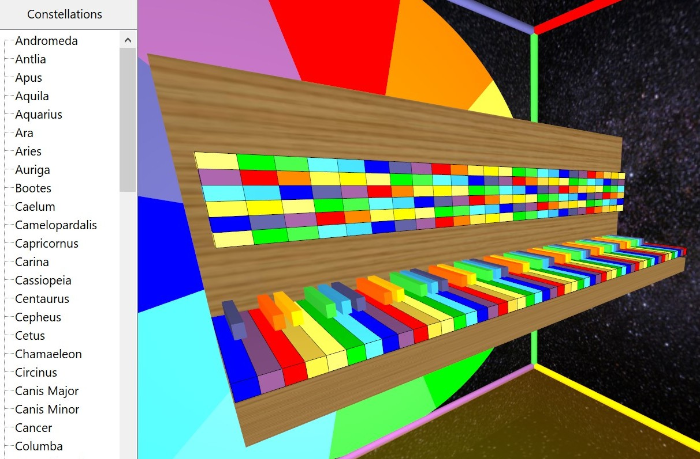

# Stellarfon

Цветомузыкальный астросеквенсор для создания, исполнения и редактирования MIDI записей.

Основным виртуальным инструментом сцены является 3D клавиатура фортепиано, имеющая 
88 клавиш. 
Цвет клавиш 8-и октав и секторов квинтовых кругов по умолчанию устанавливается в черно-белые клавиши 
с возможностью переключения раскраски на сонохроматическую шкалу и на цветотональные схемы Александра Скрябина.
При воспроизведении музыкальных записей и исполнении пьес на небосводе SkyDome синхронно окрашиваются, вспыхивают или гаснут,
полигоны и линии 88-ти созвездий.

Визуализация моделей основана на графическом движке [GaLaXy Engine](https://gitverse.ru/glscene/GLXEngine/) с поддержкой OpenGL, Directx и Vulkan. 
Интерактивная справка связывает интерфейс с соответствующими статьями российской 
онлайн-энциклопедии Рувики 
[Цветомузыка](https://ru.ruwiki.ru/wiki/Цветомузыка)

## Дорожная карта

При исполнении записей клавишам миди-клавиатур музыкальных инструментов 
можно назначать созвездия и отдельные звёзды. Вспыхивающие при этом звёзды спектральных классов OBAFGKM 
и на диаграмме Герцшпрунга-Рассела увеличивают свою яркость при нажатии клавиш. 
В библиотеке космической музыки композиторов Александра Скрябина, Андрея Климковского и Виктора Райтаровского 
слушатель сможет перемещаться по 3д сцене в VR шлеме или AR очках в сопровождении гида и музыки с объёмным звуком. 

В ходе воспроизведения композиции может быть включена опция последовательного соединения центров созвездий 
лазерными лучами в такт с ритмом музыки, с анимацией фигур созвездий в 3D. Сценарии разыгрываются из легенд и мифов античности. 
В расширенной версии астросцена дополняется 3D моделями народных музыкальных инструментов,
включая семиструнную гитару, балалайку, аккордеон и баян. 
В этом случае цветомузыкальный секвенсор может использоваться для обучения игре на музыкальных инструментах 

