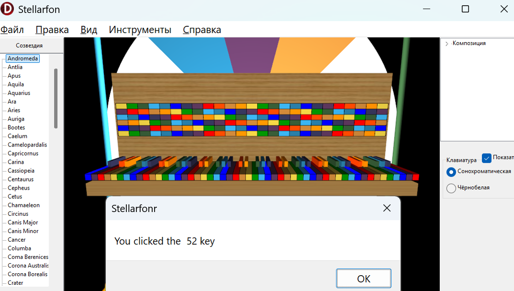

# Stellarfon

Цветомузыкальный астросеквенсор Стелларфон v.1.0 альфа

Проект аддона системы AstrobloQ для создания и исполнения космической цветомузыки и 
аудиовизуального сопровождения презентаций в экзопланетарии.
Основным компонентом сцены является виртуальная 3D клавиатура фортепиано со стандартными 
88-ю клавишами по числу 88-и созвездий. 
Выше расположена панель с грифом гитары с цветными ладами под шестью струнами. 
Цвет клавиш 8-и октав и секторов квинтовых кругов по умолчанию устанавливается согласно 
сонохроматической шкале, с возможностью переключения на цветотональные схемы Скрябина, 
Римского-Корсакова, Ньютона. 

Визуализация моделей основана на графическом движке [GaLaXy Engine](https://gitverse.ru/glscene/GLXEngine/) с поддержкой OpenGL, Directx и Vulkan. 
Интерактивная справка связывает интерфейс с соответствующими статьями российской 
онлайн-энциклопедии Рувики 
[Цветомузыка](https://ru.ruwiki.ru/wiki/Цветомузыка)

## Дорожная карта Roadmap

При воспроизведении музыкальных записей, исполнении пьес с помощью миди-клавиатуры, 
на синтезаторе, на графическом объекте TGLSkyDome синхронно загораются полигоны созвездий 
или их групповые контуры в аккордах. Узлы дерева TTreeView с названиями и символами созвездий 
взаимосвязаны с клавишами. Можно назначить клавишам не созвездия, а отдельные звёзды и зажигать их.  
Вспыхивающие при этом звёзды в контурах созвездий раскрашиваются по цветовой гамме 
OBAFGKM спектральных классов Гарвардской шкалы - временно увеличивается их светимость 
в зависимости от  громкости звучания нот. 
У композиторов космической музыки, таких как Александр Скрябин, Андрей Климковский, Виктор Райтаровский и другие, 
есть произведения для плейлиста о созвездиях. Слушатель сможет перемещаться по космической сцене 
в VR шлеме или AR очках в сопровождении гида и музыки с объёмным звуком. 
Надо отметить, что в музыкальном секвенсоре Cakewalk таких опций нет.
Скорее всего отдельный плагин Stellarfon можно было бы встроить в FL Studio, 
поскольку близки средства разработки, но FL Studio не опенсорс.
В ходе воспроизведения композиции может быть включена опция последовательного соединения центрлв созвездий лучами в такт 
с ритмом, с анимацией фигур созвездий в 3D. Сценарии разыгрываются из легенд и мифов античности. 
В расширенной версии астротеатр будет дополнен другими 3D моделями музыкальных инструментов,
включая гитарный гриф на отдельной цветопанели с подключёнием к нему гитариста,
играющего на акустической или электрогитаре. 

