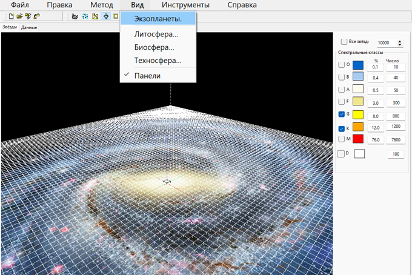
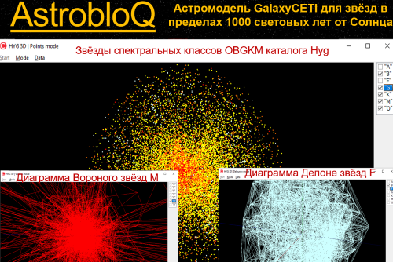
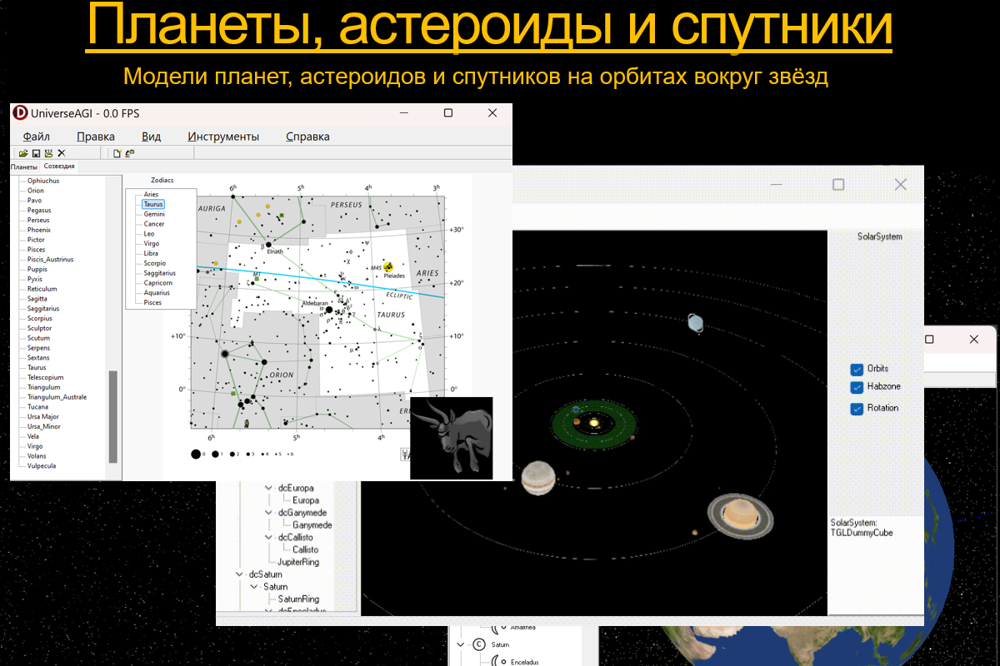
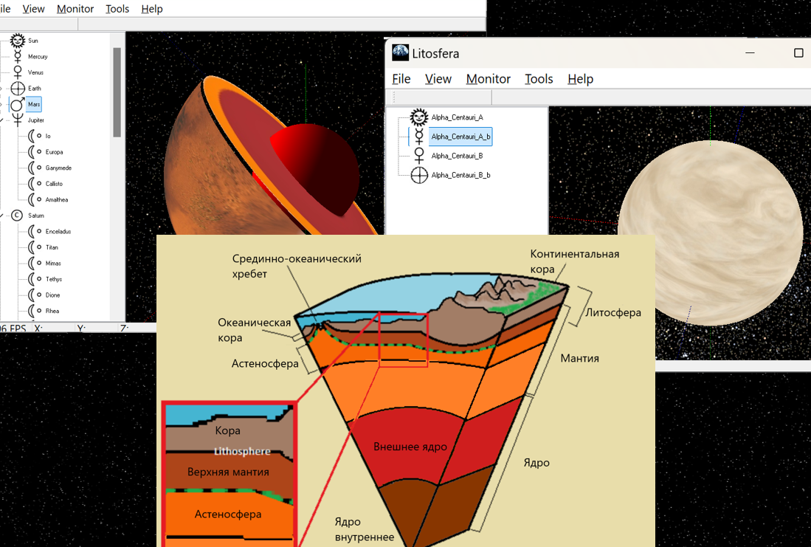
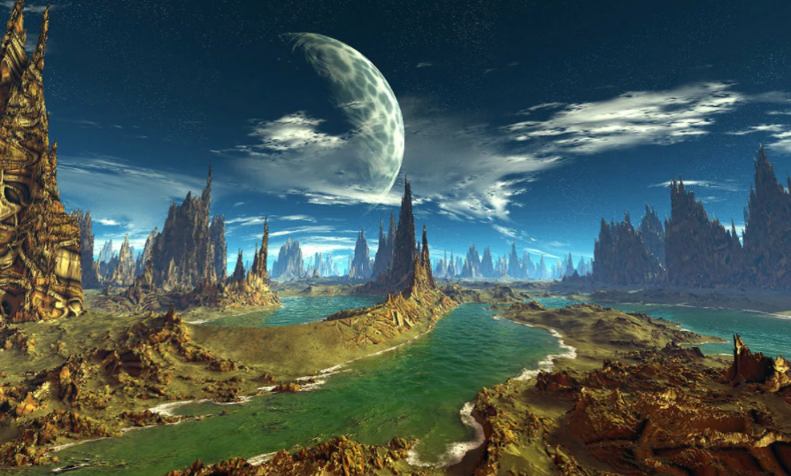
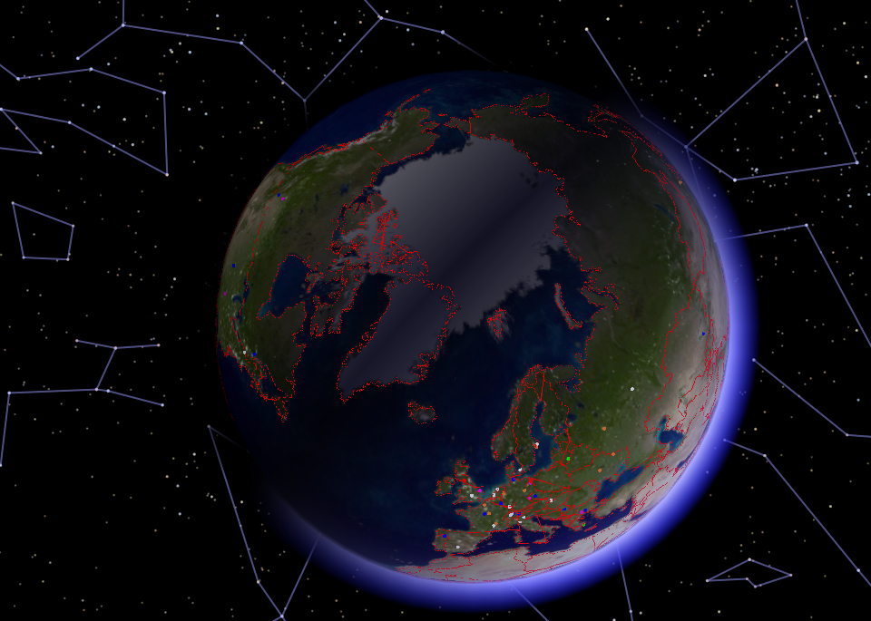

# AstrobloQ

Программная платформа AstrobloQ разрабатывается для создания проектов построения виртуальных моделей Солнечной системы, 
Млечного Пути и Вселенной с обеспечением поддержки искусственного интеллекта GigaCode и OpenAI Assistents. 
Для дальнейшего развития астрометрического и астрофизического направлений AstrobloQ приглашаются программисты    
[Российских астрономических организаций и вузов](https://gitverse.ru/UniverseCETI/GalaxyCETI)

Визуализация моделей основана на графическом движке [GaLaXy Engine](https://gitverse.ru/glscene/GLXEngine) с поддержкой OpenGL, Directx и Vulkan. 
Сборка проектов выполняется путём компиляции C/C++/Delphi с подключением библиотек открытого исходного кода, в том числе
компонентов [GLXEngine](https://github.com/glscene/GLXEngine);
[SOFA](http://iausofa.org/current_C.html) - стандарта фундаментальной астрономии, рекомендованного для астрометрии
[IAU, MAC - Международным Астрономическим Союзом](https://rosastronomy.ru/partners/mac-iau/),
и на базе данных звёздных каталогов [Gaia DR3](https://www.cosmos.esa.int/web/gaia/data) и 
[HYG](https://github.com/astronexus/HYG-Database).

Моделирование строения, структуры и состава космических объектов выполняется в последовательности PlanetAGI -> StarAGI -> GalaxyAGI -> UniversеAGI. 
AGI - Astro General Intelligence. Интерактивная справка обеспечивает связь управляющих элементов интерфейса с соответствующими темами российской онлайн-энциклопедии Рувики
[Галактика](https://ru.ruwiki.ru/wiki/Галактика)

 

Репозиторий AstrobloQ содержит базовые проекты, аддоны и плагины:

## TerraPlanetc C++ Project

TerraPlanets - визуализация солнечной и ближайших экзопланетных систем с землеподобными планетами

## LithoSphere C++ Project

Litosfera – литосферы экзопланет с гидросферами, атмосферами и недрами

## BioSphere C++ Project

Biosfera – биосферы экзопланет с моделями популяций живых организмов 

## NooSphere C++ Project

Noosfera – ноосферы экзопланет с астроинтеллектом без межзвёздных коммуникаций, ContactDisable 

## TehnoSphere C++ Project

Tehnosfera - техносферы экзопланетных систем с межзвёздными коммуникациями, ContactAble 

### Астромодели GalaxyAGI Галактики и UniverseAGI Вселенной
 
Используются следующие входные данные и вычислительные методы: 
- галактическая окрестность Солнца визуализируется по базам данных и звёздным каталогам HYG и Gaia DR3, NASA exoplanets;
- коммуникационные тетраэдральные сети Делоне генерируются в Tetgen по известным x, y, z значениям положений звёзд в галактической системе координат и по векторам vx, vy, vz их собственных движений с экстраполяцией в прошлое и будущее на шкале -10; 0; +10 Gyr;
- полиэдральные пространственные диаграммы Вороного, мозаики со звёздами в центральных узлах ячеек, рассчитываются как двойственные графы тетраэдрализации Делоне;
- построение униформных решёток GalaxyGrid выполняется по методу NNI, Natural Neighbour Interpolation, с учётом влияния в интерполянте астрофизических характеристик соседних регионов;
- симуляция формирования строения Галактики на базе подходов N-body, гравитационно взаимодействующих партикулярных кластеров и волновых функций;
- образование звёздных популяций имитируется на основе стохастических функций свёртки рождения и гибели звёзд основных спектральных классов Гарвардской шкалы согласно диаграмме Герцшпрунга-Рассела;
- при моделировании эволюции небесных тел и конволюции скоплений звёзд применяются операции групповой свёртки спектральных классов звёзд; 
- поиск кратчайшего наиболее безопасного пути между удалёнными звёздами Галактики, задачи коммивояжера, освоения ресурсов и колонизации решаются на 5D графах (x,y,z,t,c) тетрамеша и по алгоритму A* на регулярной решетке GalaxyGrid; 
- для галактической сеточной модели GalaxyDelaunay прогнозируется число литосфер, биосфер и техносфер на базе данных обновляемых звёздных каталогов;
- потенциал обитаемости GalaxyAGI с моделями техносфер, способных к межзвёздным контактам на различных этапах коэволюции, оценивается по диаграмме GalaxyVoronoi и сравнивается с результатами вероятностной оценки по эмпирической формуле Дрейка;
- численное решение парадокса Ферми-Циолковского FTP может быть получено как для изолированных галактических техносфер, так и связанных сетью GalaxyСETI для I и II типа КЦ по шкале академика РАН Н.С.Кардашёва;
- дополнительная информация о звёздном составе и строении невидимой части Галактики, за плотными облаками рукавов и ядром, может быть также получена из галактической сети GalaxyCETI;  
- навигация по модели UniverseCETI, как симуляция межгалактических коммуникаций в VR/AR, осуществляется к DeepSky и процедурно генерируемым объектам дальнего космоса и экзопланетам.

[Админ](https://t.me/astronoology)
