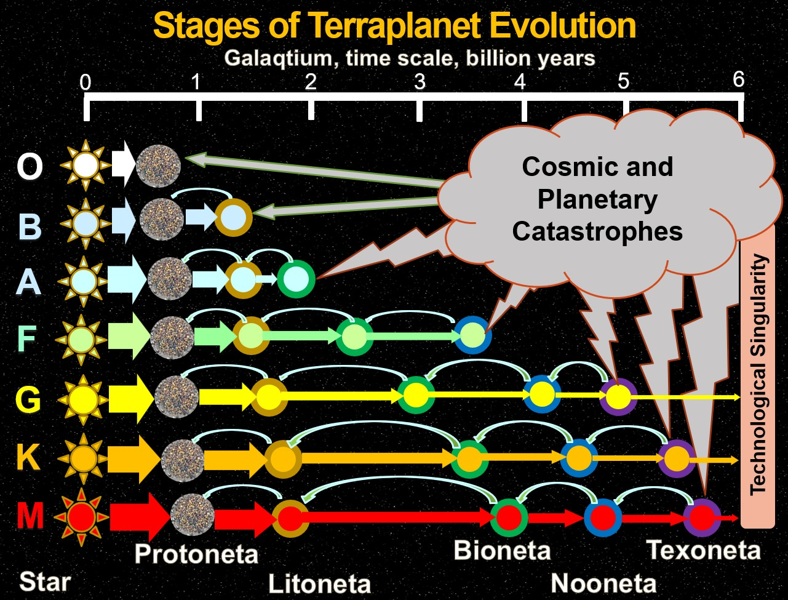

# AstrobloQ

Система астромоделирования эволюции Галактики и численного решения парадокса Ферми. 

Проекты разрабатываются на базе библиотеки GaLaXy Engine с компонентами GLScene VCL и GXScene FMX:
- [GaLaXy Engine](https://gitverse.ru/glscene/GLXEngine/);

Для астрометрических расчётов дополнительно могут использоваться следующие библиотеки: 
- [SOFA](./Externals/sofa), астрометрия на Cи, рекомендованная Международным Астрономическим Союзом IAU;
- [Astronomy Engine](./Externals/astronomy), пакет утилит по астрономии и гравитационным взаимодействиям;
- [IVOA](https://www.ivoa.net/astronomers/applications.html), стандарты Международной Виртуальной Обсерватории;
- [PostGIS](https://postgis.net/), расширение PostgreSQL для работы с пространственными данными;
- [CGAL](https://www.cgal.org/), библиотека алгоритмов по вычислительной геометрии на С++;

Интерактивная справка вызывается в зависимости от языка интерфейса:   
- [Galaxy](https://en.wikipedia.com/wiki/Galaxy), англоязычный раздел энциклопедии Wikipedia;
- [Галактика](https://ru.ruwiki.ru/wiki/Галактика), российская энциклопедия Рувики;
- подключение внешнего ИИ помощника или AI-Assistant;

 
### AstroScene

Звёзды с экзопланетными системами

### Litoneta

Экзопланета с литосферой

### Bioneta

Экзопланета с биосферой
 

### Texneta

Экзопланета с техносферой

## Galaqtium

В астромодели используются следующие данные и методы: 

- исходные данные о звёздах и экзопланетах находятся в каталогах [HYG](https://github.com/astronexus/HYG-Database), [Gaia DR3](https://www.cosmos.esa.int/web/gaia/data), [Earthlike Terraplanets](https://phl.upr.edu/hwc);
- строение, структура и состав объектов в системах "Star->Galaxy->Universe" представляются в соответствующих масштабах с различным уровнем детализации L.O.D; 
- тетраэдральные сетки TetraDel строятся по известным x,y,z координатам звёзд в галактической системе координат и по векторам vx,vy,vz их собственных движений с экстраполяцией в прошлое и будущее на шкале -10;0;+10 Gyr;
- диаграммы сеток полиэдров PolyVor рассчитываются как двойственные графы тетраэдрализации Делоне;
- для построения грид-модели GalaGrid с кубическими ячейками галавокселей используется метод интерполяции NNI, Natural Neighbour Interpolation, учитывающем влияние соседних регионов, за исключением областей GalaxyVoids;
- изменение структуры Галактики во времени моделируется на базе [волновых функций плотности](https://github.com/beltoforion/Galaxy-Renderer) и путём экстраполяции данных звёздных каталогов в будущее;
- эволюция звёздных популяций прогнозируется согласно диаграмме Герцшпрунга-Рассела для звёздного каталога HYG;
- при моделировании коэволюции рассеянных скоплений звёзд, шаровых скоплений и галактик применяется операция свёртки рождения и гибели спектральных классов звёзд; 
- текстурные карты поверхности [землеподобных экзопланет](https://science.nasa.gov/exoplanets) синтезируются с помощью ИИ на основе измеренных параметров террапланет в зонах обитаемости звёзд; 
- задачи поиска кратчайшего безопасного межзвёздного пути, задача коммивояжера, освоения ресурсов и колонизации решаются на графах (x,y,z,t,c) тетрасети и по алгоритму A* на регулярной решетке GalaxyGrid; 
- для модели Галактики оценивается число планет с литосферами, биосферами, ноосферами и техносферами, состав модели за ядром и плотными газово-пылевыми облаками определяется путём экстраполяции структуры;
- оценка потенциала обитаемости Галактики выполняется по диаграмме Вороного и сопоставляется с интегральной формулой Дрейка; 
- численное решение парадокса Ферми даёт верхнюю оценку вероятного числа КЦ I типа по шкале академика РАН Н.С.Кардашёва;

### Среды и инструменты разработки
- RAD Studio Community Edition, VS Code, GigaCode, GigaStudio.    
- [Git](https://git-scm.com/downloads/win), консольная утилита отслеживания изменений и контроля версий.
- [TortoiseGit](https://tortoisegit.org/),  графическая оболочка Git с установкой клиента в Windows Explorer.
- [Beyond Compare](https://www.scootersoftware.com/), программа сравнения, слияния и синхронизации данных. 
- [Notepad++](https://notepad-plus-plus.org/), текстовый редактор исходных кодов для программистов.
- [PasDoc](https://pasdoc.github.io/), средство составления HTML документации путём сбора комментариев из исходного кода проекта. 
- [Inno Setup](https://jrsoftware.org/isinfo.php), программа создания инсталляторов приложений Windows.

Проекты AstrobloQ можно использовать в [образовании и научных организациях](https://gitverse.ru/UniverseCETI/GalaxyCETI/) 
и для стартапов со ссылкой в описании программ и указанием в диалоге справки логотипа "AsQ". 

Приглашаем принять участие в развитии AstrobloQ, объединяющем программы 
по астрономии и космонавтике на российской платформе открытого кода. 
Для подключения к разработке можно зарегистрироваться на GitVerse, открыть аккаунт и добавить репозиторий 
[AstrobloQ](https://gitverse.ru/glscene/AstrobloQ/) в избранное. 
Соавторам и партнёрам разработки обеспечивается доступ к релизам как публичных (public), так и приватных (private) программ 
с инсталляторами приложений.  

Астроблок

[Admin](https://t.me/glscene)
