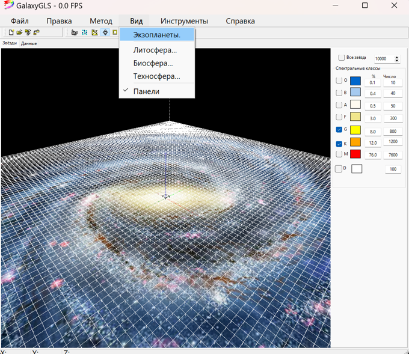

# AstrobloQ

Астромодель звёздного состава, строения и эволюции Млечного Пути, 
прогнозирование её обитаемости и сети коммуникаций между техносферами 

Репозиторий включает проекты:

Litosfera – литосфера планеты с гидросферой, атмосферой и недрами
Biosfera – биосфера планеты с живыми организмами 
Noosfera – ноосфера планеты без межзвёздных коммуникаций 
Tehnosfera - техносфера планеты с межзвёздными коммуникациями    

TerraPlanets - визуализация солнечной системы и инопланетных систем с землеподобными планетами

© OOO «AstrobloQ», 2020-2025
