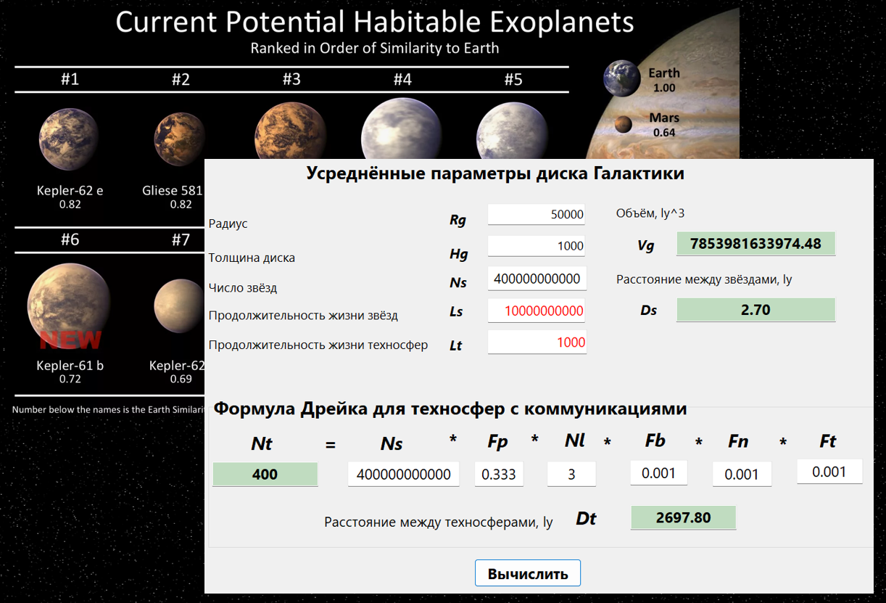

# AstrobloQ

Программный комплекс AstrobloQ для построения виртуальной модели эволюции Галактики. 
В разработке применяются кросс-платформенные компоненты [GLScene/GXScene](https://gitflic.ru/project/glscene/glxengine) 
для языков Delphi & C++ с встроенным CyberAI и возможностью подключения внешнего помощника AI-Assistant. 
При параллельных вычислениях используются библиотеки: 
- [SOFA](./Externals/sofa), астрометрия на C, рекомендованная Международным Астрономическим Союзом IAU;
- [Astronomy Engine](./Externals/astronomy), пакет утилит астрономии и гравитационных взаимодействий;
- [IVOA](https://www.ivoa.net/astronomers/applications.html), стандарты Международной Виртуальной Обсерватории;
- [CGAL](https://www.cgal.org/), библиотека алгоритмов по вычислительной геометрии на С++;
- [OpenCV](https://opencv.org/), алгоритмы компьютерного зрения, обработки и анализа изображений на С++;
- [PostGIS](https://postgis.net/), расширение PostgreSQL для работы с пространственными данными;
- [OpenCL](https://www.khronos.org/opencl/), стандарт параллельных вычислений в гетерогенных системах.

Визуализация моделей основана на графическом движке [GaLaXy Engine](https://gitverse.ru/glscene/GLXEngine/) с поддержкой OpenGL, Directx и Vulkan. 
Интерактивная справка связывает интерфейс с соответствующими статьями российской онлайн-энциклопедии Рувики
[Галактика](https://ru.ruwiki.ru/wiki/Галактика)

 
## AstrobloQ включает следующие проекты:

### AstroScene

Звёзды с экзопланетами, картами литосфер, гидросфер, атмосфер и недр для оценки минеральных ресурсов.

### Biosfera

Биосферы экзопланет и симуляция живых организмов.
 

### Noosfera

Ноосферы экзопланет с межзвёздными коммуникациями

### GalaxCETI

При построении виртуальной модели GalaxCETI используются следующие данные, звёздные каталоги и методы вычислений: 

- входными данными служат каталоги [HYG](https://github.com/astronexus/HYG-Database), [Gaia DR3](https://www.cosmos.esa.int/web/gaia/data), [Earthlike Terraplanets](https://phl.upr.edu/hwc);
- строение, структура и состав объектов в системах "SolarSystem" -> "Galaxy" -> "Universe" моделируются с заданной точностью в разных масштабах; 
- тетраэдральные сети Делоне TetraDel строятся по известным x,y,z координатам звёзд в галактической системе координат и по векторам vx,vy,vz их собственных движений с экстраполяцией в прошлое и будущее на шкале -10;0;+10 Gyr;
- полиэдральные диаграммы Вороного PolyVor рассчитываются как двойственные графы тетраэдрализации Делоне;
- построение регулярных моделей UniGrid на униформных решётках выполняется по методу NNI, Natural Neighbour Interpolation с учётом влияния в интерполянте характеристик соседних регионов, за исключением областей войдов GalaxyVoids;
- формирование строения MilkyWay моделируется на базе [волновых функций плотности](https://github.com/beltoforion/Galaxy-Renderer) и путём экстраполяции данных звёздных каталогов в спиральной структуре;
- трансформация звёздных популяций имитируется на основе стохастических функций свёртки рождения и гибели звёзд спектральных классов согласно диаграмме Герцшпрунга-Рассела;
- при моделировании коэволюции скоплений звёзд применяются операция свёртки, групповой свёртки спектральных классов звёзд; 
- текстурные и топографические карты [землеподобных экзопланет](https://science.nasa.gov/exoplanets) синтезируются с помощью ИИ на основе установленных астрофизических параметров в зонах обитаемости звёзд; 
- задачи поиска кратчайшего, наиболее безопасного межзвёздного пути, задача коммивояжера, освоения ресурсов и колонизации решаются на 5D графах (x,y,z,t,c) тетрасети и по алгоритму A* на регулярной решетке GalaxyGrid; 
- для модели GalaxyBox прогнозируется число литосфер, биосфер, ноосфер и техносфер на базе данных обновляемых звёздных каталогов;
- оценка потенциала обитаемости Галактики выполняется по диаграммам Вороного GalaxyVor и сопоставляется с эмпирической формулой Дрейка;
- численное решение парадокса Ферми-Циолковского в GalaxyGrid предполагает вероятность существования ВЦ I и II типов по шкале академика РАН Н.С.Кардашёва;
- состав модели GalaxCETI за плотными газово-пылевыми облаками и ядром прогнозируется исходя из анализа спиральной структуры MilkyWay;  
- навигация по модели Universium выполняется в VR/AR между наблюдаемыми небесными телами и процедурно генерируемыми космическими объектами.

Проекты на базе AstrobloQ могут быть как публичными, так и приватными, в том числе коммерческими. 
По лицензии MPL 2.0 графический движок [GaLaXy Engine](https://gitverse.ru/glscene/GLXEngine/) можно свободно использовать
в [научных организациях](https://gitverse.ru/UniverseCETI/GalaxyCETI/).

[Admin](https://t.me/astronoology)
