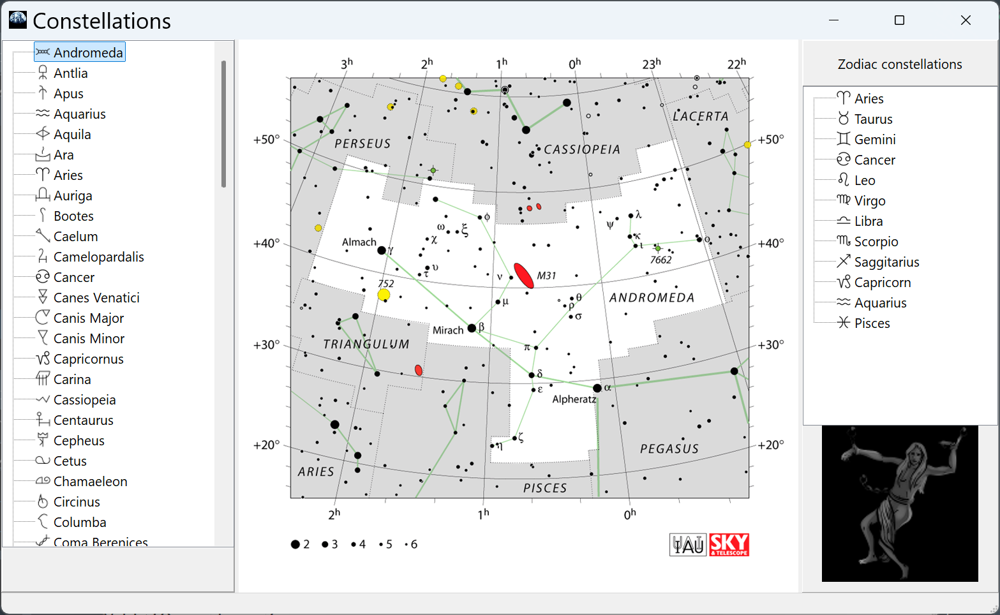
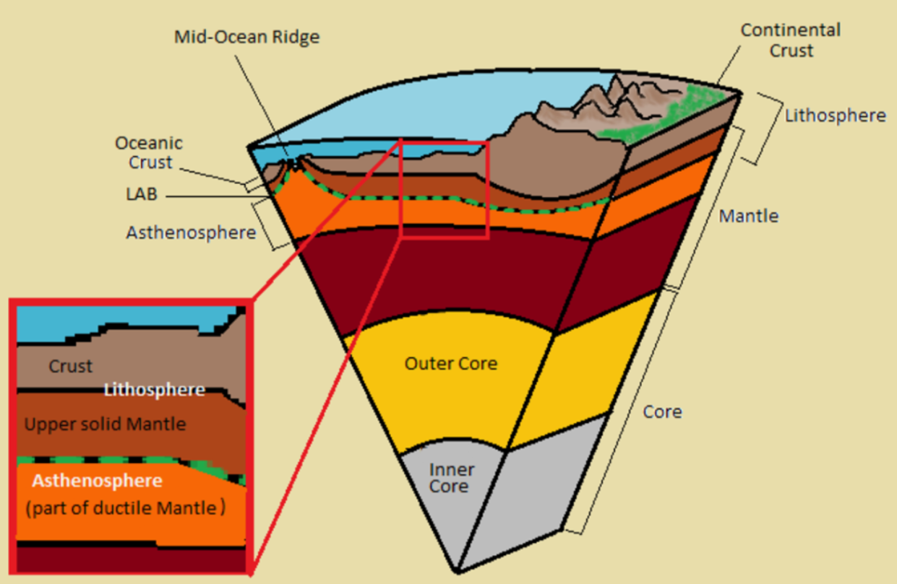
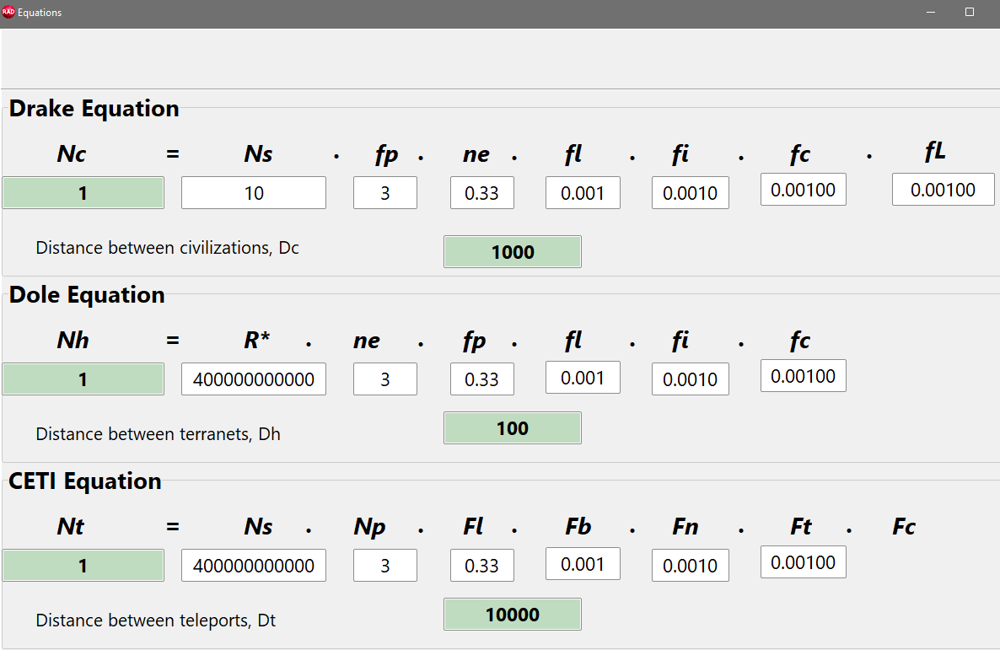

# AstrobloQ

A system for modelling the nooevolution of the Milky Way and numerically solving the Fermi paradox
with the help of AI assistance.

The development based on GLXEngine with component packages GLScene & GXScene 
for RAD Studio Delphi/C++Builder

Projects of APEX plugins include the following additional libraries:
- [SOFA](./Externals/sofa), C-based astrometry library recommended by the International Astronomical Union (IAU);
- [Astronomy Engine](./Externals/astronomy), a utilities package for astronomy and gravitational interactions;
- [IVOA](https://www.ivoa.net/astronomers/applications.html), standards of the International Virtual Observatory Alliance;
- [PostGIS](https://postgis.net/), a PostgreSQL extension for working with spatial data;
- [CGAL](https://www.cgal.org/), a C++ computational geometry algorithms library;

Interactive help is invoked depending on the interface language:
- [Galaxy](https://en.wikipedia.com/wiki/Galaxy), the English-language Wikipedia encyclopedia section;
- external AI-Assistant;

### AstroScene

Stars with exoplanetary systems

### Litoneta

Exoplanet with a lithosphere

### Bioneta

Exoplanet with a biosphere

### Texoneta

Exoplanet with a technosphere

## Galaqtium

Building AI Model CETI of the Milky Way

The following data and methods are used to build the VR model:

- source data on stars and exoplanets from the catalogs [HYG](https://github.com/astronexus/HYG-Database), [Gaia DR3](https://www.cosmos.esa.int/web/gaia/data), [Earthlike Terraplanets](https://phl.upr.edu/hwc);
- the structure, composition, and layout of objects in "Star -> Galaxy -> Universe" systems are represented at appropriate scales with varying levels of detail (LOD);
- tetrahedral TetraDelaunay meshes are constructed from known x, y, z coordinates of stars in the galactic coordinate system and from the vx, vy, vz vectors of their proper motions, with extrapolation into the past and future on a -10; 0; +10 Gyr timescale;
- polyhedron PolyVoronoi grid diagrams are computed as dual graphs of Delaunay tetrahedralization;
- to build the uniform GalaGrid model with cubic starblock cells, the Natural Neighbour Interpolation (NNI) method is used, which accounts for the influence of neighboring regions, excluding GalaxyVoids areas;
- changes in the Galaxy's structure over time are modeled using [density wave functions](https://github.com/beltoforion/Galaxy-Renderer) and by extrapolating stellar catalog data into the future;
- the evolution of stellar associations is estimated from the HYG star catalog according to the Hertzsprung–Russell diagram;
- surface texture maps of [Earth-like exoplanets](https://science.nasa.gov/exoplanets) are synthesized based on specific parameters of terraplanets in stellar habitable zones;
- the problems of finding the shortest safe interstellar path of a space traveler, resource exploitation, and colonization are solved on (x, y, z, t, c) graphs of the tetramesh and using the A* algorithm on GalaGrid;
- the stellar population behind the Galactic core and gas-dust clouds is determined through extrapolation and stereological methods;
- the co-evolution of star clusters with exoplanets over time is modeled based on convolution operations of birth and death of stellar spectral classes;
- based on the integration results, the mean number of planets with lithospheres, biospheres, noospheres, and technospheres in the chronology of the Milky Way is estimated;
- the habitability potential of the Galaxy is determined over a 10 Gyr star formation period and compared with the estimate from the statistical Drake equation;
- the numerical solution of the Fermi paradox yields an upper bound on the probable number of Type I civilizations on the scale of RAS Academician N. S. Kardashev;

### Development environments and additional tools
- IDE RAD Studio Delphi & C++ Builder, Delphi Community Edition, GigaIDE.
- [GLXEngine](https://github.com/glscene).
- [Git](https://git-scm.com/downloads/win), a command-line utility for change tracking and version control.
- [TortoiseGit](https://tortoisegit.org/), a graphical Git client integrated into Windows Explorer.
- [Beyond Compare](https://www.scootersoftware.com/), a tool for comparing, merging, and synchronizing data.
- [Notepad++](https://notepad-plus-plus.org/), a source code text editor for programmers.

The releases of the system's programs can be used separately 
provided that the help window displays the "AstrobloQ" logo with a reference to the repository of source codes.
Welcome to join the project and participate in the development of the AstrobloQ system. 

Admin
