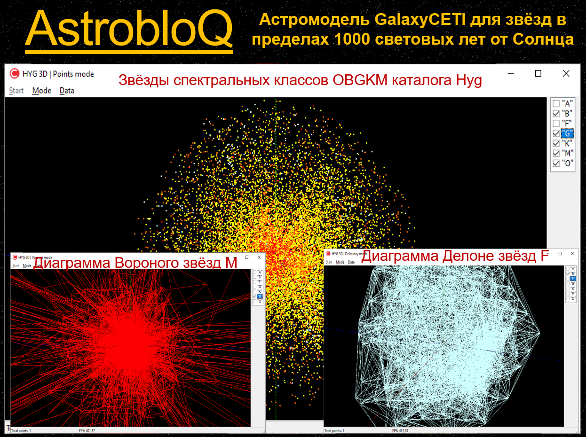

# AstrobloQ

Астромодель строения Млечного Пути и структуры Вселенной. 
Разрабатывается как групповой проект на базе астрономических библиотек 
Astronomy, SOFA (IAU) и графического движка GLXEngine,
с возможностью подключения ИИ GigaChat для моделирования космических объектов, 
начиная от астероидов, комет, малых небесных тел 
до планет, звёздных систем, галактик и видимой Вселенной. 
Интерактивная справка устанавливает связь интерфейса со статьями из 
российской онлайн-энциклопедии https://ru.ruwiki.ru/wiki/Галактика
 

Репозиторий включает проекты:

TerraPlanets - визуализация солнечной и экзопланетных систем с землеподобными планетами
в масштабах PlanetAI -> StarAI -> GalaxyAI -> UniversеAI.  

Litosfera – литосферы экзопланет с гидросферами, атмосферами и недрами

Biosfera – биосферы экзопланет с живыми организмами 

Noosfera – ноосферы экзопланет без коммуникаций NotInterStellars

Tehnosfera - техносферы экзопланет с коммуникациями InterStellars 
и AI (Astro Intelligence & Artificial Intelligence).   
Дополнительная информация о звёздном составе невидимой за ядром части Галактики, её строения и эволюции, 
 в том числе прогнозирование плотности распределения обитаемости, может быть получена в результате подключения
к CETI техносфер.  

Дополнительная информация о проекте.
Для создания астромодели GalaxyAI используются следующие методы, базы данных и каталоги:
- галактическая окрестность Солнца со звёздами и планетными системами отображается по звёздным каталогам Hyg и DR3 Gaia с помощью GLXEngine;
- эволюция звёздной популяции Галактики имитируется на основе функций свёртки рождения и гибели звёзд основных спектральных классов согласно диаграмме Герцшпрунга-Рассела;
- симуляция строения и динамической структуры спиральной формы Млечного Пути осуществляется на базе подходов N-body, гравитационно взаимодействующих партикулярных кластеров и волновых функций;
- галактические тетраэдральные сети Делоне генерируются по точкам с известными x, y, z значениями положений звёзд в галактической системе координат и по векторам vx, vy, vz их собственных движений в интервалах времени с экстраполяцией сеток в прошлое и будущее на шкале -10; 0; +10 Gyr;
- полиэдральные объёмные диаграммы Вороного с ячейками, в ядрах которых находятся центры звёзд, рассчитываются как двойственные графы тетраэдрализации Делоне;
- построение униформной, регулярной и однородной решётки GalaxyGrid в рамках модели GalaxyAI, с интерполяцией астрофизических характеристик звёзд с   планетными системами внутри кубических ячеек выполняется по методу NNI, Natural Neighbour Interpolation с учётом влияния соседей в интерполянте;
- для оценки числа литосфер, и прогнозирования числа биосфер, ноосфер и техносфер в ячейках дискретной грид модели, применяется дифференциальный подход с прогнозированием на базе данных постоянно обновляемых звёздных каталогов;
- оценка числа техносфер, способных к коммуникациям на различных этапах эволюции Галактики и прогноз их количества по диаграмме GalaxyVoronoi, сравнивается с результатами вероятностной оценки по эмпирической формуле Дрейка;
- навигация на моделях звездолётов возможна в любую точку Галактики с посещением уже открытых 5000 экзопланет и неограниченного множества процедурно генерируемых миров, в том числе потенциально обитаемых;
- поиск кратчайшего и наиболее безопасного пути между звёздами, задача коммивояжера, освоения ресурсов и колонизации решаются на 5D графах (x,y,z,t,c) динамической тетраэдральной сетки и по алгоритму AStar на униформной решетке GalaxyGrid; 
- численное решение парадокса Ферми-Циолковского для различной плотности распределения техносфер в зонах обитаемости Галактики, связанных глобальной сетью CETI или локальными коммуникационныыми сетями, 
предполагается для I и II типов КЦ по шкале академика РАН Н.С.Кардашёва.

Организации: GalaxyCETI; ООО "AstrobloQ"; НИУ «БелГУ».  

