# AstrobloQ

Система астромоделирования нооэволюции Млечного Пути и численного решения парадокса Ферми. 

Проекты по астрометрии включают следующие дополнительные библиотеки: 
- [SOFA](./Externals/sofa), астрометрия на Cи, рекомендованная Международным Астрономическим Союзом IAU;
- [Astronomy Engine](./Externals/astronomy), пакет утилит по астрономии и гравитационным взаимодействиям;
- [IVOA](https://www.ivoa.net/astronomers/applications.html), стандарты Международной Виртуальной Обсерватории;
- [PostGIS](https://postgis.net/), расширение PostgreSQL для работы с пространственными данными;
- [CGAL](https://www.cgal.org/), библиотека алгоритмов по вычислительной геометрии на С++;

Интерактивная справка вызывается в зависимости от языка интерфейса:   
- [Galaxy](https://en.wikipedia.com/wiki/Galaxy), англоязычный раздел энциклопедии Wikipedia;
- [Галактика](https://ru.ruwiki.ru/wiki/Галактика), российская энциклопедия Рувики;
- внешний AI-Assistant;

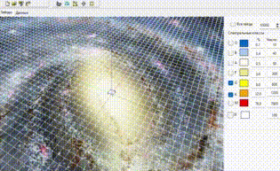
 
### AstroScene

Звёзды с экзопланетными системами

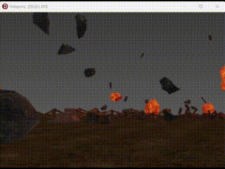

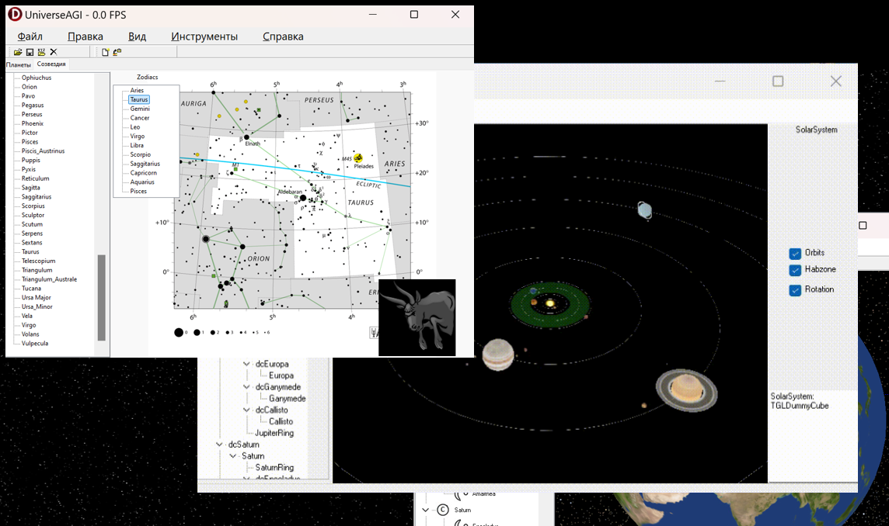
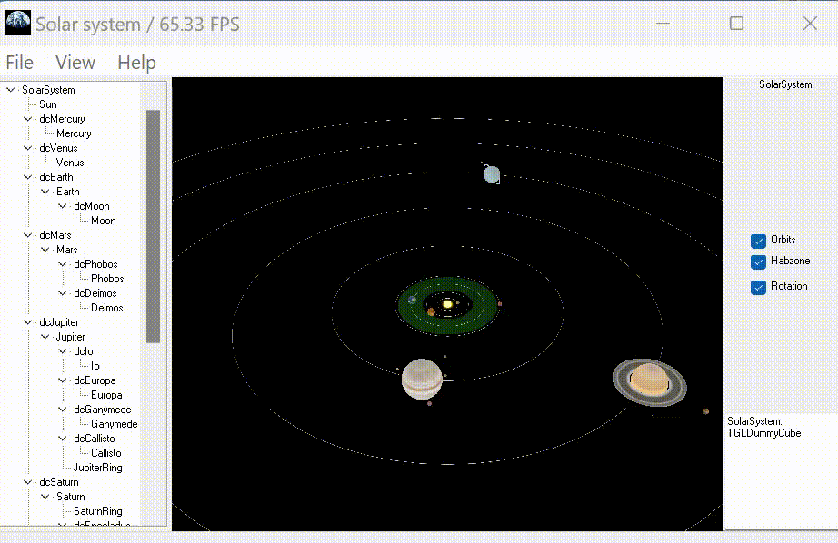

### Litoneta

Экзопланета с литосферой

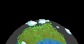

### Bioneta

Экзопланета с биосферой
 
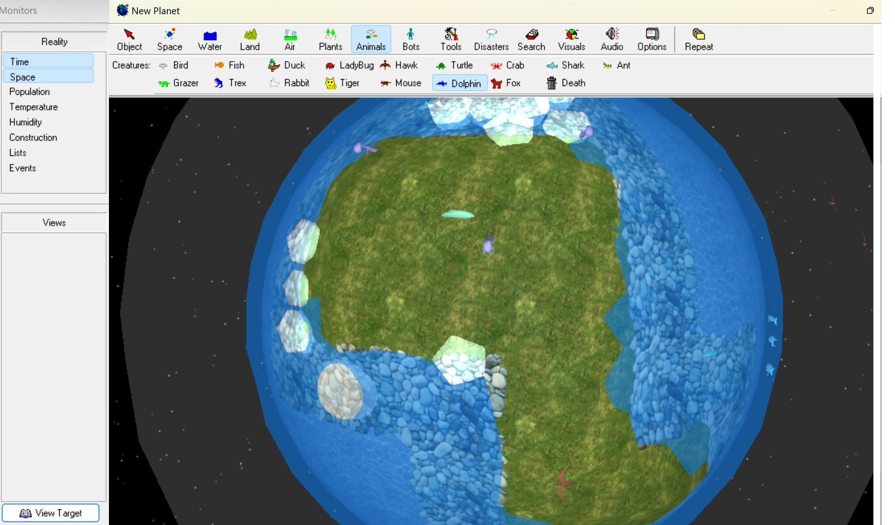

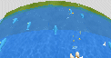
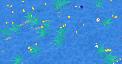
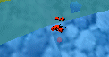
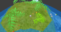

### Texoneta

Экзопланета с техносферой
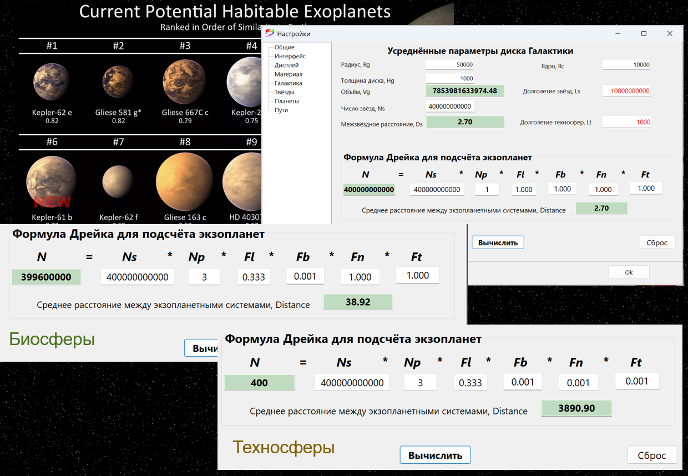

## Galaqtium

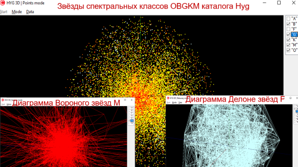
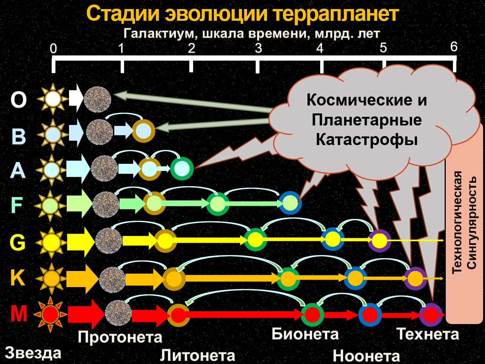

При построении астромодели используются следующие данные и методы: 

- исходные данные о звёздах и экзопланетах находятся в каталогах [HYG](https://github.com/astronexus/HYG-Database), [Gaia DR3](https://www.cosmos.esa.int/web/gaia/data), [Earthlike Terraplanets](https://phl.upr.edu/hwc);
- строение, структура и состав объектов в системах "Star->Galaxy->Universe" представляются в соответствующих масштабах с различным уровнем детализации L.O.D; 
- тетраэдральные сетки TetraDelaunay строятся по известным x,y,z координатам звёзд в галактической системе координат и по векторам vx,vy,vz их собственных движений с экстраполяцией в прошлое и будущее на шкале -10;0;+10 Gyr;
- диаграммы сеток полиэдров PolyVoronoi рассчитываются как двойственные графы тетраэдрализации Делоне;
- для построения униформной GalaGrid модели с кубическими ячейками галавокселей используется метод интерполяции NNI, Natural Neighbour Interpolation, учитывающем влияние соседних регионов, за исключением областей GalaxyVoids;
- изменение структуры Галактики во времени моделируется на базе [волновых функций плотности](https://github.com/beltoforion/Galaxy-Renderer) и путём экстраполяции данных звёздных каталогов в будущее;
- эволюция звёздных ассоциаций оценивается по звёздному каталогу HYG согласно диаграмме Герцшпрунга-Рассела;
- текстурные карты поверхности [землеподобных экзопланет](https://science.nasa.gov/exoplanets) синтезируются по определённым параметрам террапланет в зонах обитаемости звёзд; 
- задачи поиска кратчайшего безопасного межзвёздного пути космовояжера, освоения ресурсов и колонизации решаются на графах (x,y,z,t,c) тетрасети и алгоритму A* на GalaGrid; 
- состав популяции звёзд за ядром Галактики и газово-пылевыми облаками определяется с помощью экстраполяции и методами стереологии;
- коэволюция звёздных скоплений с экзопланетами во времени моделируется на основе операций свёртки рождения и гибели спектральных классов звёзд; 
- по результатам интегрирования оценивается среднее число планет с литосферами, биосферами, ноосферами и техносферами в хронологии Млечного Пути;
- потенциал обитаемости Галактики определяется за период звездообразования 10 gyr и сопоставляется с оценкой по статистическому уравнению Дрейка; 
- численное решение парадокса Ферми даёт верхнюю оценку вероятного числа КЦ I типа по шкале академика РАН Н.С.Кардашёва;

### Среды и инструменты разработки
- IDE RAD Studio Delphi & C++ Builder, Delphi Community Edition, VS Studio, GigaStudio.
- [GLXEngine](https://github.com/glscene) или [GaLaXy Engine](https://gitverse.ru/glscene/GLXEngine/);
- [Git](https://git-scm.com/downloads/win), консольная утилита отслеживания изменений и контроля версий.
- [TortoiseGit](https://tortoisegit.org/),  графическая оболочка Git с установкой клиента в Windows Explorer.
- [Beyond Compare](https://www.scootersoftware.com/), программа сравнения, слияния и синхронизации данных. 
- [Notepad++](https://notepad-plus-plus.org/), текстовый редактор исходных кодов для программистов.

Подпрограммы системы для MS Windows 11 можно использовать отдельно в [образовании и научных организациях](https://gitverse.ru/UniverseCETI/GalaxyCETI/) 
с указанием в окне справки логотипа "AsQ" со ссылкой в описании на [AstrobloQ](https://gitverse.ru/glscene/AstrobloQ/).

Вы можете принять участие в развитии системы AstrobloQ, в комплексе программ по астрономии и космонавтике на российской платформе открытого кода. 
Для подключения к разработке необходимо получить аккаунт на GitVerse, добавить репозиторий AstrobloQ
в избранное, получить у администратора права на запись в репозиторий и 
внести вклад в моделирование, обоработку данных и улучшение программного кода. 

Астроблок

[Admin](https://t.me/glscene)
